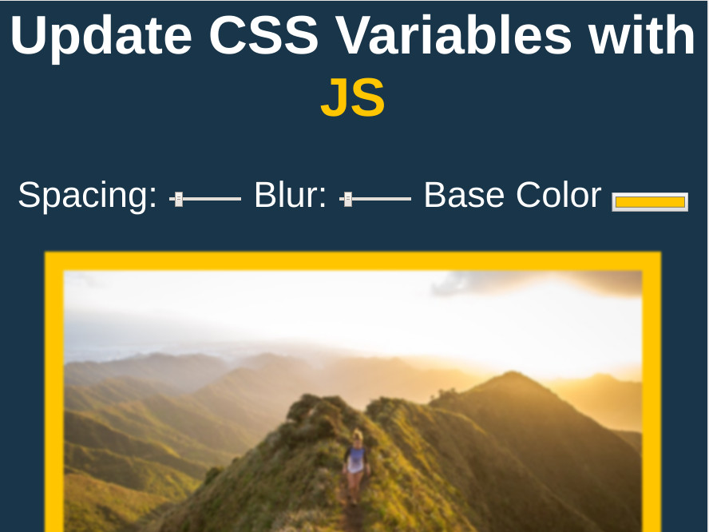

# CSS Variables and Javascript
Three CSS variables are declared, spacing, blur, and base color.  With JavaScript, the CSS variables can be updated. Users can dynamically modify the appearance of the image on the page.

## Live Demo

Click for a [Live Demo.](http://apps.javierlona.com/css-variables-and-js/)

## Installing

Download the zip file and launch index.html in your web browser.

## License

This project is licensed under the MIT License - see the [LICENSE](LICENSE) file for details

## Acknowledgments

* [Wes Bos JavaScript30](https://javascript30.com/)
